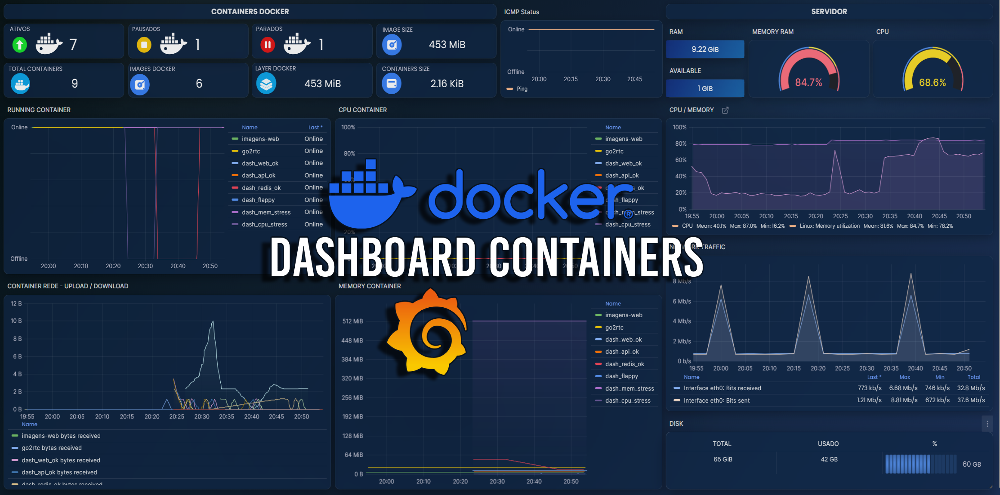
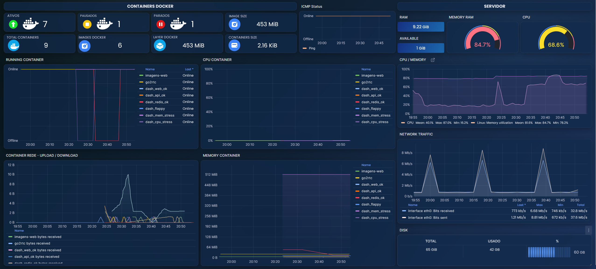

# Monitoring_docker_dashboard_grafana
Dashboard personalizada do Grafana para monitoramento de containers Docker e infraestrutura Linux, utilizando o Zabbix como datasource.



A dashboard foi projetada com foco em clareza visual, status em tempo real e histórico confiável, permitindo identificar rapidamente containers online, parados ou pausados, além de acompanhar métricas essenciais de desempenho.

###  Principais recursos

Monitoramento automático de containers Docker via Zabbix (LLD)
Indicadores visuais de status (UP / DOWN / PAUSED)
Métricas de CPU, memória, rede (bytes sent / received) e disco
Gráficos no estilo ICMP-like (0/1) para leitura rápida de disponibilidade
Identificação clara por nome de container (regex otimizado)
Ícones SVG personalizados para status e recursos (CPU, disco, Docker layers)
Layout moderno, otimizado para leitura contínua (NOC / operação)

### Stack utilizada

Grafana
Zabbix (datasource alexanderzobnin-zabbix-datasource)
Docker / Docker Compose

### Objetivo
- Fornecer uma visão centralizada e confiável do estado dos containers e do host, facilitando:
- diagnóstico rápido de falhas
- análise histórica de instabilidade
- validação visual de ambientes Docker

Grafana Lab: https://grafana.com/grafana/dashboards/24854
Plugin Canvas: https://grafana.com/grafana/plugins/canvas/



### Docker Compose

Use o Docker Compose para subir containers para visualizar a dashboard.

docker-compose.yaml
````
docker compose up -d
````
